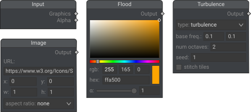
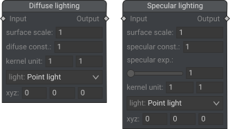
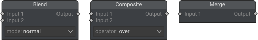
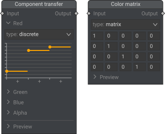

# Supported nodes

## Input:

* Input (special node, does not correspond to an SVG element);
* Flood (`<feFlood>`);
* Image (`<feImage>`);
* Turbulance (`<feTurbulence>`).

## Lighting

* Diffuse lighting (`<feDiffuseLighting>`);
* Specular lighting (`<feSpecularLighting>`).

## Geometry manipulation

* Offset (`<feOffset>`);
* Convolve matrix (`<feConvolveMatrix>`);
* Displacement map (`<feDisplacementMap>`);
* Gaussian blur (`<feGaussianBlur>`);
* Morphology (`<feMorphology>`).

## Combining

* Blend (`<feBlend>`);
* Composite (`<feComposite>`);
* Merge (`<feMerge>`).

## Color manipulation

* Color matrix (`<feColorMatrix>`);
* Component transfer (`<feComponentTransfer>`).

