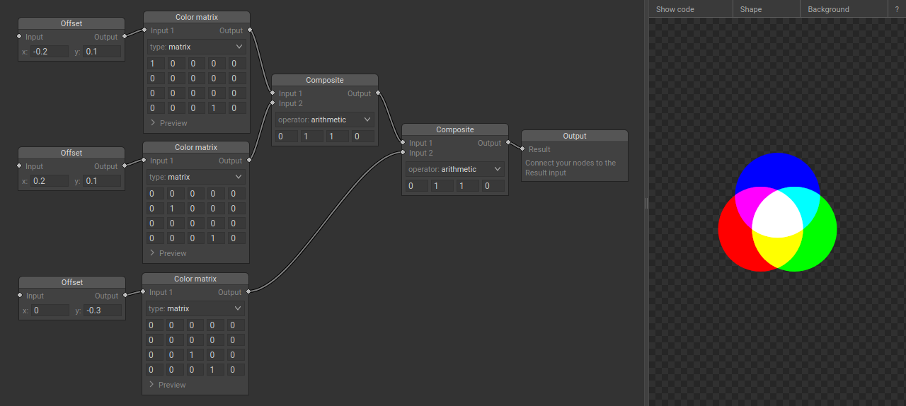
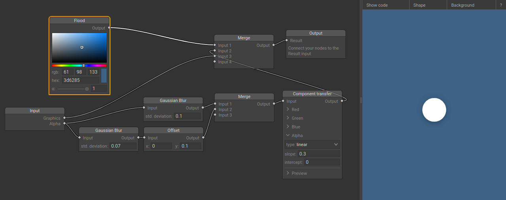

# svg-filter-editor

A node-based editor for SVG filters. It supports most filter primitives defined in SVG 1.1 Specification.

SVG filter contains multiple stages, defined by their types, parameters, and sets of inputs and outputs. Each of these stages is represented by a node in the editor. Connections between a node's input and some other node's output define the order in which the filter's primitives are going to be applied.

## Screenshots





## Installation

The editor is available online at https://poletaevvlad.github.io/svg-filter-editor/.

To get a copy of the editor locally, clone this repository, install dependencies, and build it:

```sh
git clone https://github.com/poletaevvlad/svg-filter-editor.git
cd svg-filter-editor
node install
npx grunt
```

An HTML, CSS, and JS files will be placed in the build directory.
